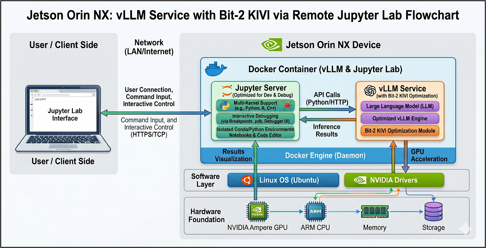
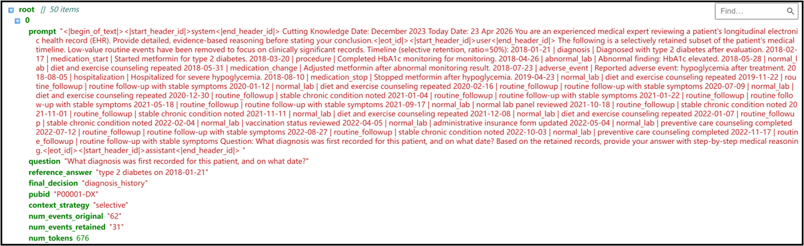

# KV Cache Management on Edge Device
---

An experimental framework for optimizing LLM KV cache on the **NVIDIA Jetson Orin NX 16GB**, applied to medical question-answering using synthetic EHR data.

This project benchmarks KV cache optimizations on Llama-3.2-3B by comparing a baseline Grouped-Query Attention (GQA) stack against vLLM's PagedAttention and 2-bit KV cache quantization.

**Credits:**
* **Jetson Deployment & KV Cache Optimization:** Gong Yizhi
* **Synthetic EHR data provided by group member:** Chen Donghua

---

## 📋 Table of Contents

- [Introduction](#-introduction)
- [Firmware](#-firmware)
- [Structure](#-structure)
- [Command](#-command-to-work)
- [Pipeline](#-pipeline)
- [Dataset](#-dataset)
- [Comparison Result](#-comparision-result)
- [Metrics](#-metrics)
- [Jtop](#-jtop)
- [Reference](#-reference)

---

## 🚀 Introduction

When deploying Large Language Models (LLMs) on edge devices, the **KV Cache becomes the primary memory bottleneck for long-context inference** except from the parameters size. This project systematically evaluates the following solutions on an **NVIDIA Jetson Orin NX** (16GB LPDDR5 unified memory) using the **Llama-3.2-3B** (GQA architecture) model:

| Method | Principle | Goal |
|------|---------|------|
| **Baseline** | HuggingFace default (FP16 contiguous tensors) | Baseline reference |
| **PagedAttention** | vLLM engine with block-based memory pooling | Eliminate memory fragmentation  |
| **KIVI** | 2-bit asymmetric quantization | Extreme KV Cache compression |


 The workflow involves running the required memory management or quantization environment inside a **container**, while leveraging **JupyterLab** for per-kernel debugging. 

 A **Pipeline** figure was shown below to get better understanding.





**Dataset**：
* Synthetic EHR (Electronic Health Record) timelines and Q&A pairs, supporting a **Selective Retention** strategy. *( provided by Chen Donghua).*

---

## 🖥️ Firmware

| Component | Specification |
|---|---|
| **Hardware** | NVIDIA Jetson Orin NX 16GB |
| **OS / System** | JetPack 6.x (L4T R36.x, Ubuntu 22.04 aarch64) |
| **CUDA** | 12.x |
| **Python** | 3.10+ |
| **PyTorch** | NVIDIA Jetson specific wheel (non-PyPI version) |

> **Unified Memory Note:** The Jetson architecture utilizes a unified memory model, sharing 16GB of LPDDR5 between the CPU and GPU. The base operating system and Jupyterlab debug environment consume approximately 4–6 GB, leaving around **10–12 GB** of available memory for inference and experiments.

---

## 📁 Structure

```
.
├── configs/
│   └── experiment_config.yaml          # unified experiment config
├── notebooks/                          # run in order
│   ├── 00_env_check.ipynb              # verify JetPack / CUDA / memory budget
│   ├── 01_data_prep.ipynb              # load dataset, save prompts to results/
│   ├── 02_baseline_gqa.ipynb           # Baseline: HF DynamicCache + OOM probe
│   ├── 03_gqa_paged.ipynb              # PagedAttention via vLLM
│   ├── 04_gqa_kivi.ipynb               # KIVI 2-bit quantization (LLaMA)
│   └── 04_gqa_kivi_qwen.ipynb          # KIVI 2-bit quantization (Qwen, archived)
├── preprocessing/
│   └── Final Project/                  # synthetic EHR pipeline (author: Chen Donghua)
├── results/                            # CSV / JSON outputs and figures
├── scripts/
│   ├── deploy_to_jetson.sh             # one-click rsync + env setup
│   ├── setup_vllm_jetson.sh            # vLLM Jetson install
│   ├── setup_kivi_jetson.sh            # KIVI CUDA backend compile
│   ├── jetson_llama_prompt_check.py    # prompt sanity check on device
│   └── plot_results_comparison.py      # result visualization
├── src/
│   ├── ehr_bridge.py                   # EHR prompt assembly (selective retention)
│   ├── dataset_utils.py                # dataset loading and prompt caching
│   ├── metrics.py                      # TTFT / TPOT / memory measurement engine
│   ├── jetson_utils.py                 # Jetson environment detection and safe loading
│   ├── vllm_runner.py                  # vLLM PagedAttention wrapper
│   ├── paged_cache.py                  # simplified paged KV cache
│   ├── paged_kivi_cache.py             # Paged + KIVI combined cache
│   ├── perplexity.py                   # sliding-window PPL evaluation
│   └── llama_kivi_2.py                  # ！ KIVI attention injection 
├── llama_kivi.py                       # full LLaMA model KIVI rewrite
├── mistral_kivi.py                     # Mistral model KIVI rewrite
├── utils_quant.py                      # shared quantization utilities
└── requirements_jetson.txt             # Jetson-specific dependencies
```

---

## ⚡ Command to work

### 1. setup (if needed)

Inside terminal of jetson：

```bash
#  install jupyter
pip install jupyterlab ipykernel
python3 -m ipykernel install --user --name kv_cache --display-name "KV Cache (venv)"
```

> **注意**：PyTorch 必须使用 NVIDIA 提供的 Jetson 专用 wheel

### 2. JupyterLab
Inside terminal of jetson：
```bash
jupyter lab list

# start Jupyter Lab（systemd ）
sudo systemctl start jupyter

# new lab
jupyter lab --ip=0.0.0.0 --port=8888 --no-browser
```

**Go to JupyterLab ：**
- 在上位机浏览器打开：`[http://<JETSON_IP>:8888/lab/tree/KV_cache_experiment/results](http://10.30.54.15:8888/lab/tree/KV_cache_experiment/results)` 
- Jetson ip： 10.30.54.15
- Jetson token needed


### 3.  🚀 Deployment
- JupyterLab remote access configuration
- KIVI CUDA backend compilation (`TORCH_CUDA_ARCH_LIST="8.7"`)
- Troubleshooting (OOM, CUDA unavailable, compilation errors, etc.)

### vLLM Docker startup
inside jupyter lab, open a new terminal
here already clone vllm code
```bash
# give permission to docker
sudo docker ps -a

# Enter the jetson-containers directory to automatically find the most suitable vLLM image

cd jetson-containers
sudo jetson-containers run -v /home/gyz/KV_cache_experiment:/workspace -p 8889:8888 $(autotag vllm)
#  -p <host_port>:<container_port>, allowing external access to the container.
#  This maps the container's 8888 port to the physical machine's 8889 port to avoid conflicts with the host's existing Jupyter and enable remote access.
#  Note: dustynv/vllm:0.8.6-r36.4-cu128-24.04 is the best image.
```

After downloading and starting, you will automatically be inside the container:
```bash
# 
pip install pandas datasets jupyterlab matplotlib -i https://pypi.tuna.tsinghua.edu.cn/simple

# 
cd /workspace

# Start JupyterLab (must add --allow-root inside the container)
pkill -f jupyter
jupyter lab --ip=0.0.0.0 --port=8888 --allow-root --no-browser


# 上位机

http://10.30.54.15:8889

#Then enter the token provided in your terminal output (example below):

http://ubuntu:8889/lab?token=ae6a36b549829dd62a0a305e9d6c213714b247ba6950800a
```

### Container environment

| Conponent | version |
|------|------|
| vLLM | 0.8.6+cu128 |
| PyTorch | 2.7.0+cu128 |
| CUDA (torch) | 12.8 |
| nvcc | 12.8.93 |
| Triton | 3.3.0 |

> 💡 Note: All packages are pre-compiled for JetPack 6 + CUDA 12.8 + Orin. This avoids source code compilation compatibility issues for packages containing CUDA kernels (such as Triton).

**Custom Repository Configuration (Container Environment Variables):**
```
PIP_INDEX_URL=https://pypi.jetson-ai-lab.dev/jp6/cu128
TAR_INDEX_URL=https://apt.jetson-ai-lab.dev/jp6/cu128/24.04
```


---


## 🔬 pipeline

| number | Notebook | Content |
|------|----------|------|
| 00 | `00_env_check.ipynb` |  JetPack / CUDA / memory |
| 01 | `01_data_prep.ipynb` | EHR Bridge, get prompts (`results/ehr_prompts.json`) |
| 02 | `02_baseline_gqa.ipynb` | **Baseline** |
| 03 | `03_gqa_paged.ipynb` | **PagedAttention** |
| 04 | `04_gqa_kivi.ipynb` | **KIVI** |
| 04 | `04_gqa_kivi_qwen.ipynb` | **KIVI**：Qwen 架构 2-bit 量化评测 废弃 |

After each notebook runs, the model memory will be automatically released to ensure the security of the graphics memory for the next stage.

---

## 🗂️ Dataset

The `src/ehr_bridge.py` script serves as the core interface, utilizing generated timelines and Q&A `.jsonl` files to assemble prompts.This part is modified based on the code provided by Chen dongyang, if any question related to his part, please check his code. All the contents he provided were condensed into this `src/ehr_bridge.py` to serve as the data for the subsequent experiments. 

### Workflow

1. **Event Scoring and Filtering**: The `score_event()` function calculates an event score based on predefined type weights. `selective_retain()` then retains the most clinically significant events based on a Top-K threshold and reorders them chronologically.
2. **Rendering and Assembly**: `render_context()` formats the context module, while `build_chat_prompt()` wraps it into a ChatML-formatted dialogue structure (requires a tokenizer and can also modified the style later).
3. **Data Loading**: `load_ehr_qa()` maps and merges fields from the timeline and Q&A JSONL files, returning a standard dictionary.

### Usage Example
```python
from src.ehr_bridge import get_selective_prompts

# Generate prompts with selective retention (ChatML format + Evaluation Metadata)
prompts = get_selective_prompts(max_samples=50)

# Standardized loading across all subsequent notebooks
prompts = load_prompts('../results/ehr_prompts.json')
```

### Prompt example

Each prompt object contains the following fields:

| Field | Description |
|------|------|
| `prompt` | The complete ChatML-formatted string (System Prompt + Selective Timeline + Question). |
| `question` | The query text. |
| `reference_answer` | The ground truth reference answer.） |
| `final_decision` | The question category (e.g., diagnosis_history). |
| `context_strategy` | The context retention strategy (e.g., selective or full_context). |
| `num_events_original` | The total number of events in the original timeline. |
| `num_events_retained` | The number of events retained after filtering. |
| `num_tokens` | The total token count of the prompt. |




---

## 🧪 Comparision Result

### 1. Baseline — HF DynamicCache

- **Mechanism**: Utilizes HuggingFace's default `DynamicCache`, storing KV Cache as FP16 contiguous tensors.
- **Challenge**: During long-context generation, PyTorch frequently requests larger contiguous memory blocks and copies old data, leading to **severe memory fragmentation** and OOM risks.
- **Use Case**: Short question-answering (output < 20 tokens).

### 2. PagedAttention — vLLM


- **Mechanism**: vLLM rewrites the entire memory management and generation logic in C++ with PagedAttention. It divides the KV Cache into fixed-size **Blocks (Pages)** and pre-allocates a static memory pool at startup (`gpu_memory_utilization=0.60`) which means that we only use 60% of memory budget.
- **Key Behaviors**:
  - After vLLM initializes, `torch.cuda.memory_allocated()` does not increase with KV Cache growth. The dynamic fluctuations measured at the PyTorch level (~25 MB) are merely temporary activations during the forward pass.
  - Fundamentally eliminates the ~200 MB memory fragmentation caused by dynamic contiguous allocation in the Baseline.
- **Benefits**:
  -  Memory fragmentation reduced from ~200 MB to ~25 MB.
  -  Decode phase **TPOT ↓ 33%**, Memory footprint **↓ 74%**.
- **Trade-offs**:
  - ⚠️ Prefill phase **TTFT ↑ 144%** (due to engine initialization and scheduling overhead).
- **Use Case**: Long-context generation (output > 100 tokens), concurrent requests. For short Q&A (output < 20 tokens), maybe the Baseline is recommended.
- **Optimization Directions**:
  - Wisely use  `gpu_memory_utilization` to prevent the OOM while get the best performance .
  - FP8 KV Cache (not supported on Ampere architecture; theoretically doubles the maximum context length).

> **💡 Note**: vLLM's scheduler and Block Manager are low-level proprietary components. This project safely extracts their internal statistics via reflection.

### 3. KIVI — 2-bit Quant

- **Mechanism**: Based on the [KIVI paper](https://github.com/jy-yuan/KIVI), it intercepts `past_key_values` at the Python/CUDA layer as a HuggingFace transformers plugin:
  - **Key Cache**: Per-channel quantization (grouped along `seq_len`, calculated along `head_dim`).
  - **Value Cache**: Per-token quantization (grouped along `head_dim`, calculated along `seq_len`).
  - **Residual Window**: The most recent `residual_length` (default 128) tokens are kept in FP16 to ensure generation quality. The total tokens size:~700
- **Implementation**:
  - First, download and compile a CUDA library provided by the original author
  -  `kivi_gemv`: CUDA kernel (Triton quantization + fused unpack), provided by [KIVI paper](https://github.com/jy-yuan/KIVI)

  - The original KIVI code only supported LlaMA and mistral; this project fully ports the core computational flow for the llama architecture.
  - So the logic is: During the prefill stage, GPU quantization is performed using Triton, which change the storage format of the KV cache. Then to Coordinate with it, we implemented a custom KV cache class (KIVICUDACache) that structurally stores quantized values, scales, see in `llama_kivi_2.py`.
  - During the decoding stage, the custom cache object directly passes the quantized tensors to the pre-compiled CUDA kernel for dequantization and computation. This kernel operates directly on GPU registers while simultaneously preserving full-precision computation for the residual length. Finally, the two results are concatenated.

  
- **Benefits**: Theoretical KV Cache compression of approximately **8×**. Quantization operations are only triggered when the residual window overflows, resulting in **no additional overhead during the Prefill phase**.

> **Note⚠️**
In the modern architecture of Hugging Face (HF) transformers, the KV Cache is no longer a simple Tuple (tuple), but has been abstracted into a specialized class (such as the default DynamicCache). It assumes that all Keys and Values are continuous tensors (Continuous Tensors) of FP16/BF16 type. Each time a new token is generated, it directly concatenates the new KV to the end of the old KV using torch.cat().
When we introduced the highly customized 2-bit compression scheme of KIVI(which has 9 components....), the native DynamicCache was completely unable to meet the requirements and a dedicated Cache class (such as KIVICache) had to be rewritten.


#### KIVI CUDA installation

```bash
# inside container
pip install triton

cd ~ && git clone https://github.com/jy-yuan/KIVI.git
cd ~/KIVI/quant

# ! Orin 的 compute capability = 8.7
TORCH_CUDA_ARCH_LIST="8.7" MAX_JOBS=4 pip install . --no-build-isolation

# python
pip install . --no-deps --no-build-isolation -i https://pypi.tuna.tsinghua.edu.cn/simple

# trial
python3 -c "import torch; import kivi_gemv; print('KIVI CUDA backend OK')"
```

## 🔑 KIVI principle

### Residual Window Management Logic

The core of KIVI is its Residual Window mechanism: the most recent `residual_length` (default 128) tokens are maintained in FP16 precision, and any tokens exceeding this threshold trigger quantization.

```python
# Check if the overflow portion needs quantization during each update
res_len = key_residual.shape[-2]          # Current length of the FP16 residual
if res_len >= residual_length + group_size:  # e.g., 128 + 32 = 160
    # 1. Extract the oldest (res_len - residual_length) tokens
    k_part = k[:, :, :n_quant, :].contiguous()
    # 2. Quantize and pack according to strategy (per-channel, 2-bit asymmetric)
    k_block = quantize_per_channel(k_part, bits=2, group_size=32)
    # 3. Append to the quantization list, crop the residual, keeping only the recent 128 tokens
    self._key_quant[layer_idx].append(k_block)
    self._key_residual[layer_idx] = k[:, :, n_quant:, :]
```

### Forward 
See in `llama_kivi_2.

`forward_kivi()` method intercepts the self-attention layer during the model's forward pass to dynamically quantize the new K/V states:
- Utilizes CUDA kernels to calculate scales and locate extremum values.
- `kivi_gemv` handles packing and fused unpacking (the C++ engine calls cuda_bmm_fA_qB_outer).

---


## 📊 Metrics

| item | meaning | how |
|------|------|----------|
| **TTFT** | Time To First Token | Measured using `time.perf_counter()` synchronized before and after the prefill phase. |
| **TPOT** | Time Per Output Token | Calculated by averaging the time taken per step during the decode phase. |
| **Peak Memory** | Peak Memory(key to OOM) | Measured via `torch.cuda.max_memory_allocated()` or `psutil` RSS.  |
| **KV Cache Memory** | KV Cache  | Extracted via a custom Cache's `memory_usage_bytes()` or reverse-engineered from vLLM's Block Manager. |
| **Fragmentation** | key to OOM | Overcomed by vLLM|
| **PPL** | Perplexity | Calculated using a sliding window to monitor generation quality degradation after quantization |
| **OOM Threshold** | Maximum safe context length | Probed via incrementally increasing context lengths, designed to safely skip rather than crash upon Out of Memory (OOM) errors. |

**Peak Memory （measured by psutil）：**
```python
import psutil, os
process = psutil.Process(os.getpid())
peak_mem = process.memory_info().rss / (1024 ** 2)  # 
```

---


## 🖥️ Jtop

Use `jtop` to monitor the GPU, CPU, and memory usage of various processes on the Jetson. Descriptions of typical processes:

| PID | Process | Description |
|---|---|---|
| Main Inference Process | `python3.12` | Consumes ~1.2 GB of system memory and ~3.4 GB of GPU memory, with ~19.5% CPU utilization. Model weights are loaded into the GPU. |
| Xorg | X11 Display Server | Consumes ~117 MB of GPU memory, responsible for graphical interface rendering. |
| gnome-shell | GNOME Desktop | Consumes ~49.9 MB of GPU memory, responsible for the top bar, window animations, and other UI elements. |
| xdg-desktop-portal | D-Bus Service | Consumes ~2.8 MB of GPU memory, providing a secure interface for sandboxed applications to access system resources. |

---

## 📚 Reference

- **KIVI**: Liu et al., "KIVI: A Tuning-Free Asymmetric 2-bit Quantization for KV Cache", 2024. ([GitHub](https://github.com/jy-yuan/KIVI))
- **vLLM**: Kwon et al., "Efficient Memory Management for Large Language Model Serving with PagedAttention", SOSP 2023. ([Docs](https://docs.vllm.ai/))
- **Jetson Containers**: [dusty-nv/jetson-containers](https://github.com/dusty-nv/jetson-containers)
